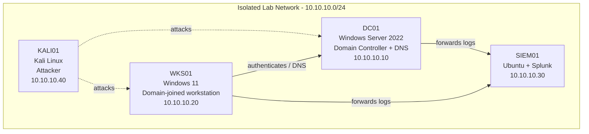

# LabScribe — Home Lab Documentation Automation
### Build specification / handoff document for Claude Code

---

## 1. Goal (read this first)

Build **LabScribe**: a desktop application that automatically documents the process
of building a home cybersecurity lab, so the user can focus on the lab itself instead
of writing documentation.

While the user builds their lab (across several virtual machines), LabScribe passively
captures what they do — terminal commands, their output, screenshots, and quick notes —
and then uses an LLM to turn that raw material into clean, structured Markdown
documentation **and** an auto-generated network diagram. Everything is driven from a
**dashboard GUI with a system-tray icon**. The user should almost never open PowerShell
or run a script by hand; they click buttons on the dashboard instead.

**One-sentence version:** a tray/dashboard app that watches a home lab being built and
writes the GitHub README (with diagrams) for you.

---

## 2. Core design principle

**Capture passively → synthesize with an LLM → present through a GUI.**

Do **not** build a real-time screen-watching agent. The system works in two phases:

1. **Capture** raw material silently while the user works (terminal transcripts,
   manual screenshots, scratch notes).
2. **Synthesize** that raw material into documentation on demand (or on a schedule),
   using the Anthropic API.

The dashboard is the control surface for both phases.

---

## 3. Hard requirements / constraints

These are non-negotiable and shaped by explicit user decisions:

- **R1 — No manual scripting in daily use.** The user must be able to start capture,
  stop capture, and generate docs entirely from the GUI. Running commands in a terminal
  is only acceptable for one-time initial setup, and even that should be automated where
  possible.
- **R2 — Packaged as an executable.** The final deliverable is a double-clickable app
  on Windows (a `.exe`), pinnable to the taskbar/dashboard. No "run `python main.py`"
  for the end user.
- **R3 — Capture must be scoped to development activity only.** Capture happens through
  (a) terminal-session transcripts and (b) *manually triggered* screenshots. **Never**
  use continuous/full-screen screen recording or timed auto-screenshots. If the user
  browses YouTube or does anything outside their lab terminals, it must NOT be captured.
  This is a privacy requirement, not a nice-to-have.
- **R4 — Secrets never get committed.** The Anthropic API key lives in a local `.env`
  file (or OS credential store) and must be covered by `.gitignore`. The app must never
  write the key into generated docs or logs.
- **R5 — Lab-only framing.** Generated content and any provisioning scripts are for an
  isolated lab the user owns. Documentation should note this where relevant.
- **R6 — Human-in-the-loop.** Generated docs are always shown to the user for review
  before being committed to their repo. Nothing auto-commits without a confirm step
  (auto-commit may exist as an opt-in setting, off by default).

---

## 4. Recommended tech stack

Pick a stack that keeps the AI logic and the GUI in one coherent project. Two good
options; **Option A is recommended** because it unifies with the Python-based AI SDK
work and is the most approachable, but Claude Code may propose Option B if it judges it
cleaner.

### Option A (recommended): Python core + local web dashboard
- **Language / core logic:** Python 3.11+
- **LLM:** official `anthropic` Python SDK
- **Backend service:** FastAPI (serves the dashboard + exposes local API endpoints)
- **Dashboard UI:** a small single-page web app (plain HTML/CSS/JS, or React if
  preferred) served locally by FastAPI
- **Native window + tray:** `pywebview` to show the dashboard in an app window, and
  `pystray` (or `pywin32`) for the system-tray icon and background running
- **Packaging:** PyInstaller → single Windows `.exe`
- **Diagrams:** generate Mermaid text; optionally shell out to `nmap` and the
  `python-libnmap` parser for network discovery
- **Git:** `GitPython` or shell `git`

### Option B (alternative): Electron or Tauri shell
- Dashboard in React/TS; Node handles orchestration; call the Anthropic **TypeScript**
  SDK from the main process. Packages cleanly to `.exe` via electron-builder / Tauri
  bundler. Choose this if a more polished, native-feeling UI is a priority. Downside:
  some lab tooling (nmap parsing) is slightly easier in Python, so a small Python
  sidecar may still be needed.

Document the final choice in the repo README.

---

## 5. System architecture

LabScribe has five components. The **control app runs on the host machine**; the lab VMs
feed data into a shared location the app watches.

```
┌──────────────────────────────────────────────────────────────┐
│                         HOST MACHINE                           │
│                                                                │
│   ┌────────────────────────────────────────────────────┐      │
│   │  LabScribe App (.exe)                               │      │
│   │  • Dashboard GUI  • System-tray icon                │      │
│   │  • Capture orchestrator                             │      │
│   │  • Synthesis engine (Anthropic API)                 │      │
│   │  • Diagram generator (nmap → Mermaid)               │      │
│   │  • Git integration                                  │      │
│   └───────────────┬────────────────────────────────────┘      │
│                   │ watches                                    │
│         ┌─────────▼──────────┐                                 │
│         │  Shared Capture     │  ← VMs write here               │
│         │  Folder             │    (VirtualBox shared folder    │
│         │  transcripts/       │     or host SMB share)          │
│         │  screenshots/       │                                 │
│         │  notes/             │                                 │
│         └─────────▲──────────┘                                 │
└───────────────────┼────────────────────────────────────────────┘
                    │ write
   ┌────────────────┼───────────────┬──────────────┬───────────┐
   │ DC01 (Win Srv) │ WKS01 (Win11) │ SIEM01(Linux)│ KALI01    │
   │ capture agent  │ capture agent │ capture agent│ capture   │
   └────────────────┴───────────────┴──────────────┴───────────┘
```

### 5.1 Capture layer
A lightweight **capture agent** is provisioned once onto each VM (LabScribe should be
able to push/generate these, so the user doesn't hand-write them):

- **Windows VMs:** a PowerShell profile snippet that runs `Start-Transcript` on every
  session, writing timestamped transcripts into the shared capture folder. This records
  commands + output only — never other apps.
- **Linux VMs:** a shell wrapper using `script` (or `asciinema`) that records the
  terminal session into the shared folder.
- **Screenshots:** the user takes manual screenshots (recommend **ShareX** on Windows,
  configured to auto-save to the shared `screenshots/` folder; note that Windows Steps
  Recorder / PSR is deprecated and must not be used). LabScribe just consumes whatever
  lands in that folder.
- **Notes:** a "Quick Note" box in the dashboard (and/or a watched `notes.md`) lets the
  user jot one-liners that get timestamped.

### 5.2 Storage layer
A single **shared capture folder** with a fixed structure:
```
capture/
  transcripts/   YYYY-MM-DD_HHMM_<host>.txt
  screenshots/   YYYY-MM-DD_HHMM_<label>.png
  notes/         notes.md   (timestamped lines)
```
The app treats this as its inbox.

### 5.3 Synthesis engine
On demand ("Generate Docs" button) or per session:
- Gather the transcripts, notes, and screenshot filenames for the selected time range /
  session.
- Send them to the Anthropic API with a system prompt that instructs the model to output
  a README section in the **exact target format** (see §7). The model should:
  - Reconstruct build steps from the commands run.
  - **Infer troubleshooting entries** (problem → cause → fix) from errors visible in the
    transcript output.
  - Reference screenshots by filename at the right points.
- Return Markdown, show it to the user for review, then append/merge into the repo README.

### 5.4 Diagram generator
- **From config:** build a Mermaid diagram from the known host inventory (hostnames, IPs,
  roles).
- **From reality (preferred):** run an `nmap` sweep of the lab subnet, parse live hosts /
  open ports, and generate/refresh the Mermaid diagram so it reflects the actual running
  environment. Output is Mermaid text embedded directly in the README (renders natively
  on GitHub). Offer PNG/SVG export via Graphviz/D2 as a stretch option.

### 5.5 Control layer (dashboard + tray)
The GUI ties it together — see §6.

---

## 6. Dashboard UI specification

A single-window dashboard, plus a persistent **system-tray icon** so the app runs quietly
in the background and can be reopened anytime.

**Primary controls (big, obvious buttons):**
- **Start Session** — begins a capture session (records start time; ensures agents are
  writing; shows a "recording" indicator).
- **Stop Session** — ends the session.
- **Generate Docs** — runs synthesis on the current/selected session and opens the review
  screen.
- **Refresh Diagram** — runs the nmap→Mermaid generation.

**Panels:**
- **Status panel:** capture on/off, current session name, elapsed time, # transcripts /
  screenshots / notes captured so far, last-generated timestamp.
- **Quick Note box:** text field + "Add note" button (timestamps and appends to notes).
- **Sessions list:** past sessions with dates; select one to (re)generate or view its docs.
- **Review screen:** shows generated Markdown side-by-side (rendered + raw), with
  **Edit**, **Regenerate**, and **Commit to repo** buttons. Nothing is committed without
  this step (per R6).
- **Settings screen:** paths (shared capture folder, target git repo), lab subnet for
  nmap, Anthropic API key entry (stored in `.env`/credential store), target README format
  template, auto-commit toggle (default off).

**Tray menu:** Show Dashboard · Start/Stop Session · Generate Docs · Quit.

---

## 7. Target documentation format

The synthesis engine must output docs matching the user's existing README template
structure. Bundle this template with the app as the default target (the user already has
a copy). Sections to populate:

1. **Overview** — one paragraph + machine inventory table (host / OS / role / IP).
2. **Network Diagram** — the auto-generated Mermaid block.
3. **Build Steps** — per machine, the settings that matter and *why* (derived from the
   transcript), with screenshot references.
4. **Troubleshooting Log** — `Issue / Cause / Fix` entries inferred from transcript errors.
   *(This is the highest-value section — prioritize getting it right.)*
5. **Attack & Detection Scenarios** — table the user fills/extends over time.
6. **Lessons Learned** — bullets.
7. **Changelog** — dated entries appended per session.

Include the Mermaid diagram inline so it renders on GitHub. Example of the diagram the
generator should produce:



---

## 8. Data flow (end to end)

1. User clicks **Start Session** on the dashboard.
2. User builds their lab in the VMs; capture agents write transcripts/screenshots/notes
   into the shared folder automatically. (User adds quick notes via the dashboard as
   desired.)
3. User clicks **Stop Session**, then **Generate Docs**.
4. App collects that session's raw material, calls the Anthropic API with the target
   format, and generates the README section + refreshed Mermaid diagram.
5. App shows the result in the **Review screen**.
6. User edits if needed, clicks **Commit to repo** → app writes files and `git commit`s.

---

## 9. Suggested repository structure

```
labscribe/
  README.md
  pyproject.toml / requirements.txt
  .env.example              # ANTHROPIC_API_KEY=...  (real .env is gitignored)
  .gitignore
  src/labscribe/
    app.py                  # entry point: tray + window bootstrap
    dashboard/              # web UI assets (html/css/js or React)
    api/                    # FastAPI routes
    capture/
      orchestrator.py       # session start/stop, folder watching
      agents/               # generated capture-agent templates for each OS
    synthesis/
      engine.py             # Anthropic calls
      prompts.py            # system prompt + format template
    diagram/
      nmap_scan.py          # subnet scan + parse
      mermaid.py            # inventory/scan -> Mermaid
    gitio/
      repo.py               # commit helpers
    config/
      settings.py           # paths, subnet, secrets loading
  templates/
    readme_template.md      # target documentation format
  build/
    build_exe.md            # PyInstaller packaging instructions
```

---

## 10. Build milestones (build in this order)

Deliver incrementally; each milestone should run before moving on.

- **M1 — Skeleton app + tray.** Launchable app window with a system-tray icon and empty
  dashboard. Settings screen that can save the shared-folder path, repo path, subnet, and
  API key (to `.env`). Verify it packages to a working `.exe`.
- **M2 — Capture orchestration.** Start/Stop Session logic; folder-watching of the shared
  capture folder; status panel showing live counts; Quick Note box. Generate the
  capture-agent snippets for Windows + Linux and document one-time install (or auto-push).
- **M3 — Synthesis engine.** Given a session's transcripts + notes, call the Anthropic API
  and produce README Markdown in the target format, including inferred troubleshooting
  entries. Review screen with edit + regenerate.
- **M4 — Diagram generation.** nmap sweep → parse → Mermaid; embed in the README; Refresh
  Diagram button.
- **M5 — Git integration.** Commit-to-repo from the review screen; changelog append;
  optional auto-commit setting (default off).
- **M6 — Packaging & polish.** Final PyInstaller build, tray UX, error handling, first-run
  setup wizard.

Each milestone = working software. Prefer a thin vertical slice over broad half-built
features.

---

## 11. Security & privacy requirements

- Enforce **R3**: only terminal transcripts + manual screenshots are ingested. No screen
  recording, no timed captures. Make this explicit in code and docs.
- API key in `.env` / OS credential store; `.env` in `.gitignore`; never logged or written
  into generated docs.
- Before committing generated docs, run a simple secret-scan pass (regex for common key
  patterns) and warn if anything key-like appears.
- Treat the lab as isolated; provisioning artifacts are lab-only.

---

## 12. Stretch goals (not required for v1)

- Cross-platform build (macOS/Linux host) via Tauri/Electron.
- PNG/SVG diagram export (Graphviz/D2) and a `python diagrams` "architecture poster" mode.
- Auto-generate per-scenario attack/detection writeups into a `/writeups` folder.
- Git hook that offers to generate docs on commit.
- Local-model option (swap the Anthropic call for a local LLM) for fully offline use.

---

## 13. Acceptance criteria (v1 done when…)

- The app launches as a `.exe` with a working dashboard + tray icon; no terminal needed.
- User can Start Session, build in the lab, add notes, Stop Session — with transcripts,
  screenshots, and notes collected automatically into the shared folder.
- Clicking Generate Docs produces README Markdown in the target format, including a
  troubleshooting log inferred from transcript errors, shown for review.
- A Mermaid network diagram is generated (from inventory and/or nmap) and embedded in the
  README.
- User can edit and commit the result to their git repo from the GUI.
- No browsing/entertainment activity is ever captured; the API key is never committed.
```
